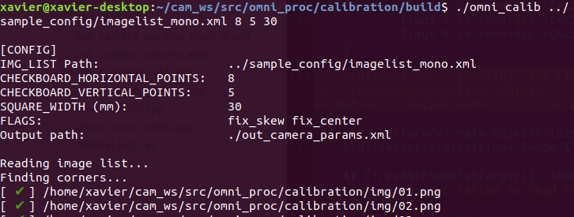
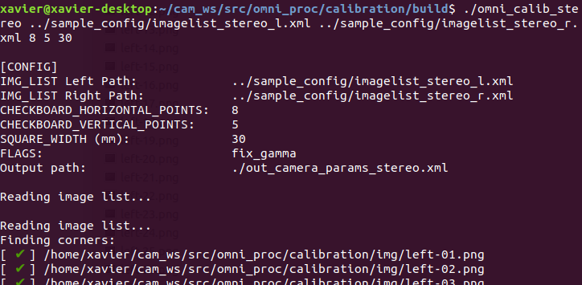
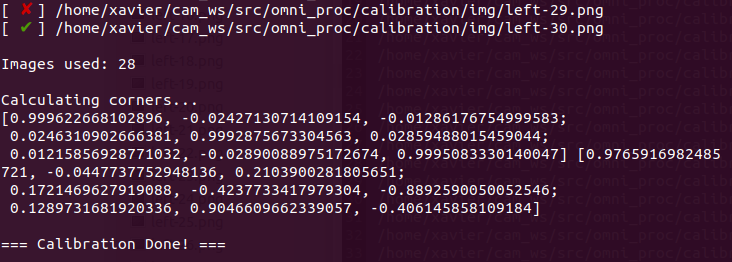

# omni_proc_ros

<a href="LICENSE" ></a>

Omnidirectional camera model processing ROS package via image transport.

## Installation

Git clone the repository into your workspace (e.g. catkin_ws).
```bash
$ cd catkin_ws/src
$ git clone https://github.com/1487quantum/omni_proc_ros.git
```

After that, recompile the workspace.
```bash
$ catkin_make
```

## Calibration

> **Note:** The calibration executables have to be compiled seperately, and would be available in the *build* directory after compilation.

### Compilation

Update the `compile_calib.sh` permission & run the script to compile the calibration executable files: *omni_calib* & *omni_calib_stereo*.

```bash
$ chmod +x compile_calib.sh
$ ./compile_calib.sh
```

To run the executable:
```bash
$ cd build
$ ./omni_calib [Parameters]
```

More details on the usage is available in _Calibration executables_ section below.

### Obtaining the images

The images to be used for the calibration could be obtained via the ROS [`camera_calibration` package](http://wiki.ros.org/camera_calibration). Perform the calibration via `cameracalibrator.py`, and click "Save" after the calibration is done (after all the gauge are green). A `calibrationdata.tar.gz` would be saved in the `/tmp/` directory. Uncompress the file, extract the images and save it in a new directory.

> The calibration info from the camera_calibration would **not be used**.

### Image list

> The sample imagelist files are available in the `sample_config` directory, and ensure that there are at least 20 images used in the calibration.

The image list would be using OpenCV Storage `xml` format, which follows this template:

```xml
<?xml version="1.0"?>
<opencv_storage>
<images>
[Full path of the images]
...
</images>
</opencv_storage>
```

#### Mono image list
The imagelist would be the same as above, ensure that the full image path is used instead of relative path.
```xml
<?xml version="1.0"?>
<opencv_storage>
<images>
 /home/ubuntu/cam_ws/omni_proc/calibration/sample_config/img/01.png
...
 /home/ubuntu/cam_ws/omni_proc/calibration/sample_config/img/10.png
</images>
</opencv_storage>
```

> The sample file is available as `imagelist_mono.xml`.

#### Stereo image list
The imagelist would be similar to the mono image list, ensure that there are 2 seperate image list for both left and right.

> The sample file is available as `imagelist_stereo_l.xml` and `imagelist_stereo_r.xml` respectively.

### Calibration executables

#### Image status


There would be a status for image when the calibration is running.

* **Green tick** - The checkerboard is detected and the image is used in the calibration.
* **Red Cross** - The checkerboard is not detected & hence not used in the calibration.
* **?** - The image could not be found in the specified location/path.

#### omni_calib [Mono]



Performs camera calibration with the provided imagelist file, which uses the `xml` format. Ensure that the full image path is entered instead of the relative path.

```bash
$ ./omni_calib [IMG_LIST]  [CHECKBOARD_HORIZONTAL_POINTS]   [CHECKBOARD_VERTICAL_POINTS]  [SQUARE_WIDTH (mm)]
```
- **IMG_LIST**: List of images to be used for calibration. (A sample could be found in the `sample` directory.)
- **CHECKBOARD_HORIZONTAL_POINTS**: Number of horizontal points on checker, count by edges of square. 
- **CHECKBOARD_VERTICAL_POINTS**: Number of vertical points on checker, count by edges of square. 
- **SQUARE_WIDTH**: Size of checkerboard square, measured in millimetres (mm).

> **Note:** Ensure that the both checkerboard horizontal & vertical points are more than 2, else the calibration wouldn't work!

At the end of the calibration, the number of images used would be stated below.


#### omni_calib_stereo



Performs camera calibration with the provided imagelist file, which uses the `xml` format. Ensure that the full image path is entered instead of the relative path.

```bash
$ ./omni_calib_stereo [IMG_LIST_LEFT]  [IMG_LIST_RIGHT]  [CHECKBOARD_HORIZONTAL_POINTS]   [CHECKBOARD_VERTICAL_POINTS]  [SQUARE_WIDTH (mm)]
```
- **IMG_LIST_LEFT**: List of *left* images to be used for calibration. (A sample could be found in the `sample` directory.)
- **IMG_LIST_RIGHT**: List of *right* images to be used for calibration. (A sample could be found in the `sample` directory.)
- **CHECKBOARD_HORIZONTAL_POINTS**: Number of horizontal points on checker, count by edges of square. 
- **CHECKBOARD_VERTICAL_POINTS**: Number of vertical points on checker, count by edges of square. 
- **SQUARE_WIDTH**: Size of checkerboard square, measured in millimetres (mm).

> **Note:** Ensure that the both checkerboard horizontal & vertical points are more than 2, else the calibration wouldn't work!

At the end of the calibration, the number of images used would be stated below.



## Param
After running the calibration, the calibration output (e.g. `out_camera_params.xml`) would be generated. Place the file in the `param` directory and rename it to `out_camera_params.xml`. This configuration would be used to recitify the input images.

## Launch files
Launch the omni_proc_ros node via *omni_mono.launch*. This would recitfy the incoming image feed using the `omnidirectional camera model` of OpenCV.
```bash
$ roslaunch omni_mono_proc omni_mono.launch
```


